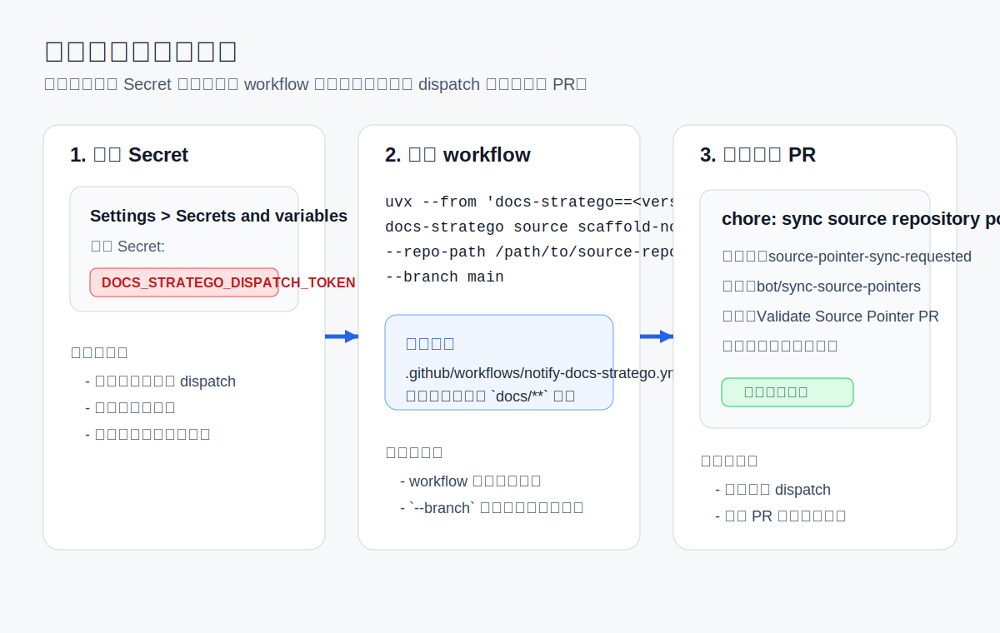

# 自动联动

这页回答的是：如何让源仓在 `docs/**` 发生变更后，自动通知 `docs-stratego` 根仓形成“同步指针 -> 共享 PR -> 人工审核”的闭环。

## 1. 什么时候该开自动联动

如果你只做一次性接入，先完成 [接入聚合站点](onboarding.md) 即可。  
只有在下面场景，才建议开自动联动：

- 该源仓会持续更新文档
- 团队希望文档变更后自动进入根仓审核流程
- 该源仓已经稳定通过 remote 模式构建验证

前提边界：

- 源仓侧命令默认假设 CLI 已作为包发布
- 如果还没发布，请先看 [CLI 分发与发布](distribution.md)

## 2. 自动联动闭环长什么样



## 3. 第一步：在源仓配置 Secret

到源仓 GitHub 仓库的 `Settings -> Secrets and variables -> Actions` 新增：

- `DOCS_STRATEGO_DISPATCH_TOKEN`

它的作用边界很明确：

- 只负责调用根仓的 `repository_dispatch`
- 不负责部署站点
- 不替代根仓自己的发布凭证

## 4. 第二步：用 CLI 生成通知 workflow

在源仓本地执行：

```bash
uvx --from 'docs-stratego==<version>' docs-stratego source scaffold-notify \
  --repo-path /path/to/source-repo \
  --branch main
```

如果要监听多个分支，可以重复传入：

```bash
--branch main --branch release
```

默认生成的文件是：

- `.github/workflows/notify-docs-stratego.yml`

默认通知目标是：

- `uroborus2s/docs-stratego`

如果你想先看结果，不真正写文件，先加：

```bash
--dry-run
```

## 5. 第三步：提交并触发一次真实演练

生成 workflow 后：

1. 把 `.github/workflows/notify-docs-stratego.yml` 提交到源仓
2. 在被监听分支修改一次 `docs/**`
3. push 到远端

此时应该看到：

- 源仓 workflow 被触发
- 根仓收到 `source-pointer-sync-requested`
- 根仓创建或复用 `bot/sync-source-pointers` 共享 PR

## 6. 这套 workflow 固定遵守哪些边界

生成后的通知 workflow 固定遵守这些约束：

- 只监听指定分支的 `docs/**` 变更
- 事件名固定为 `source-pointer-sync-requested`
- 只负责触发根仓同步，不直接发布站点
- 根仓仍需人工审核共享 PR

## 7. 如何停掉自动联动

如果你只想停掉自动通知，但暂时不想从根仓下线该源仓，执行：

```bash
uvx --from 'docs-stratego==<version>' docs-stratego source scaffold-notify \
  --repo-path /path/to/source-repo \
  --remove
```

这只会删除源仓里的通知 workflow，不会改根仓里的仓库登记。

## 8. 常见误区

### 8.1 自动联动是不是等于自动发布

不是。  
自动联动只会把变更送到根仓共享 PR，最终仍然需要维护者审核和合并。

### 8.2 我已经生成 workflow 了，为什么根仓没反应

先按顺序检查：

1. `DOCS_STRATEGO_DISPATCH_TOKEN` 是否已配置
2. workflow 是否真的提交到了目标分支
3. 本次 push 是否真的改到了 `docs/**`
4. 根仓事件名是否还是 `source-pointer-sync-requested`

### 8.3 我能不能只删 Secret，不删 workflow

可以，但不推荐。  
那样会留下一个会持续失败的 workflow。更好的做法是直接执行 `--remove`。

## 9. 验收清单

- [ ] `DOCS_STRATEGO_DISPATCH_TOKEN` 已配置
- [ ] `.github/workflows/notify-docs-stratego.yml` 已提交到源仓
- [ ] 在目标分支修改 `docs/**` 后，源仓 workflow 会触发
- [ ] 根仓收到 `source-pointer-sync-requested`
- [ ] 根仓形成或复用 `bot/sync-source-pointers` 共享 PR

## 10. 接下来读什么

- 想看共享 PR 审核方式：读 [维护者指南](../operator-guide.md)
- 想查看源仓侧和根仓侧命令总表：读 [CLI 命令](cli.md)
- 想下线源仓：读 [移除流程](offboarding.md)
