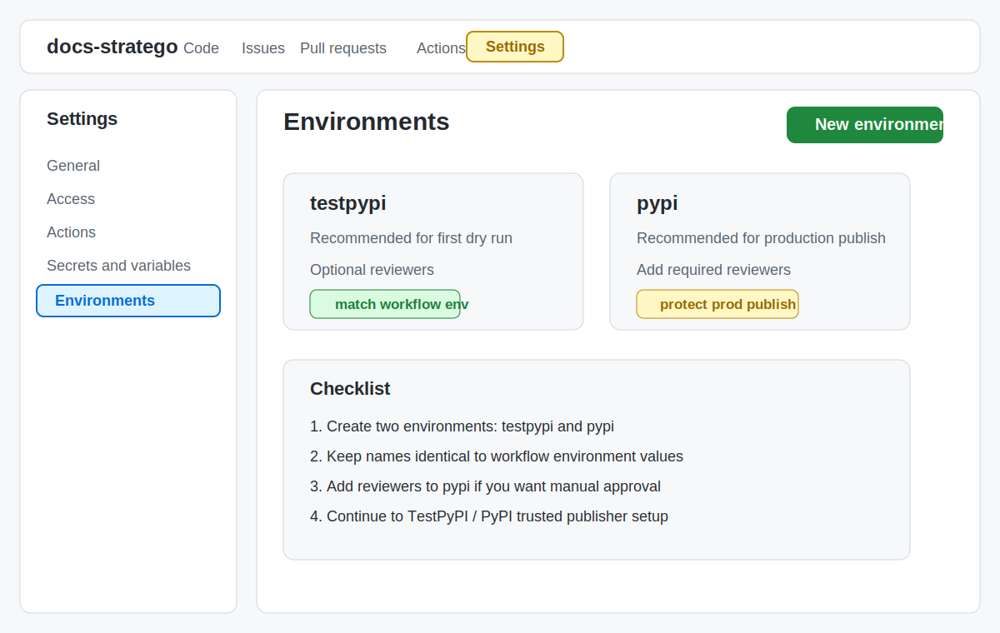
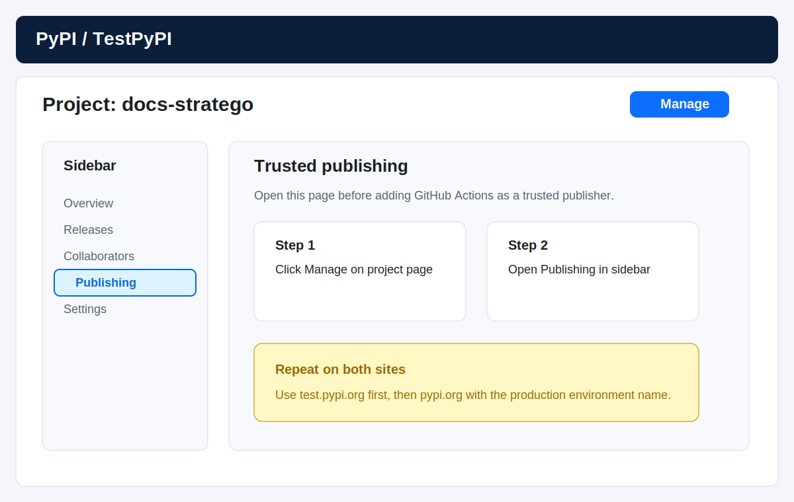
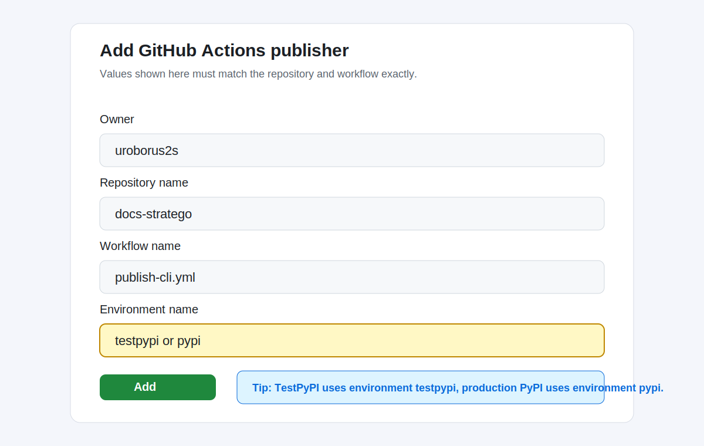
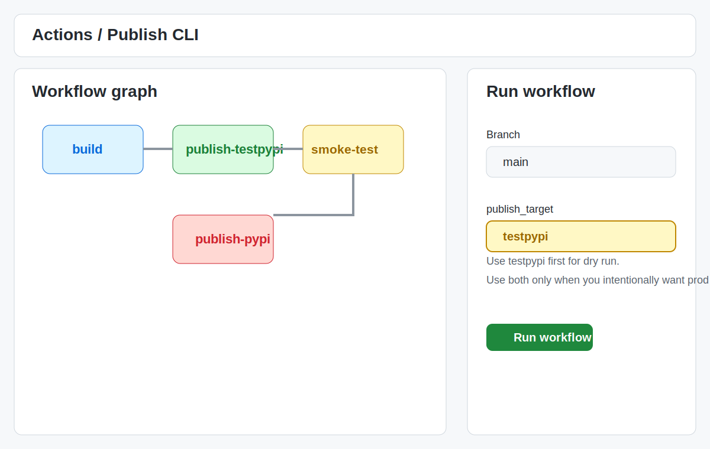

# 发布前外部配置

这页解决的是“第一次把 `docs-stratego` CLI 发到 TestPyPI / PyPI 前，GitHub 和包仓库外部要先配什么”。

如果你已经完成这些外部配置，直接继续读 [CLI 发布手册](release.md)。

## 1. 先明确这页覆盖什么

这里覆盖的是首次发布前的外部平台准备：

- GitHub 仓库里的 `testpypi` / `pypi` environments
- TestPyPI 上的 Trusted Publisher
- PyPI 上的 Trusted Publisher
- GitHub Actions 手动演练入口

这里不重复讲：

- 版本号怎么改
- tag 怎么打
- 发布后怎么验证

这些内容在 [CLI 发布手册](release.md) 里。

## 2. 发布前最低前提

开始前请确认：

- 你对 GitHub 仓库 `docs-stratego` 有 `admin` 权限
- 你对 TestPyPI 项目 `docs-stratego` 有维护权限
- 你对 PyPI 项目 `docs-stratego` 有维护权限
- 当前仓库里已经存在 `publish-cli.yml`
- 该 workflow 中用于发布的 job 已声明 `id-token: write`

当前仓库的固定值是：

| 项目 | 固定值 |
| --- | --- |
| GitHub 仓库 owner | `uroborus2s` |
| GitHub 仓库名 | `docs-stratego` |
| 发布 workflow 文件名 | `publish-cli.yml` |
| TestPyPI environment | `testpypi` |
| PyPI environment | `pypi` |

## 3. GitHub 侧配置

### 3.1 创建 `testpypi` 和 `pypi` environments

操作路径：

1. 打开仓库主页
2. 点击 `Settings`
3. 左侧点击 `Environments`
4. 点击 `New environment`
5. 先创建 `testpypi`
6. 再创建 `pypi`

建议：

- `testpypi` 可以先不加审核人，方便演练
- `pypi` 建议配置 `Required reviewers`
- 如需更严格控制，可以限制允许部署的 tag 模式

下面是 GitHub 页面定位的示意截图：

### 3.2 当前 workflow 和 environment 的绑定关系

当前仓库已经在 workflow 中固定使用：

- `publish-testpypi` job 对应 `environment: testpypi`
- `publish-pypi` job 对应 `environment: pypi`

这意味着：

- GitHub environment 名必须和 workflow 里写的一致
- TestPyPI / PyPI Trusted Publisher 的 environment 名也必须和这里一致

如果三处名字不一致，OIDC 令牌匹配会失败。

### 3.3 可选的 GitHub 保护规则

推荐做法：

| Environment | 推荐规则 |
| --- | --- |
| `testpypi` | 默认可不加审核，优先保证演练顺畅 |
| `pypi` | 配置 `Required reviewers`，必要时再加 tag 限制 |

如果你希望正式 PyPI 发布更保守，可以把 `pypi` 环境收紧到只有维护者审核后才允许执行。

## 4. TestPyPI 侧配置

如果 `docs-stratego` 还没有在 TestPyPI 上创建项目，不要直接找项目的 `Manage -> Publishing`。  
这种情况下应当先在账号侧配置 `pending publisher`，等第一次成功发布后再自动转成正常 publisher。

### 4.1 打开项目发布设置

操作路径：

1. 登录 TestPyPI
2. 打开项目 `docs-stratego`
3. 点击 `Manage`
4. 在项目侧边栏点击 `Publishing`

示意截图如下：

### 4.2 添加 Trusted Publisher

在 TestPyPI 的 `Publishing` 页面里，选择 `GitHub Actions`，填写：

| 字段 | 值 |
| --- | --- |
| Owner | `uroborus2s` |
| Repository name | `docs-stratego` |
| Workflow name | `publish-cli.yml` |
| Environment name | `testpypi` |

填写位置示意如下：

说明：

- `Workflow name` 填工作流文件名，不是 tag 名
- `Environment name` 不是必填，但这里强烈建议填，并且要与 GitHub workflow 一致
- TestPyPI 和正式 PyPI 需要分别配置，各自独立

## 5. PyPI 侧配置

正式 PyPI 的操作路径和 TestPyPI 相同，只是站点换成 `https://pypi.org/`。

如果正式 PyPI 上还不存在该项目，同样应先配置 `pending publisher`，而不是等待手工上传首个包。

打开项目 `docs-stratego` 的 `Manage -> Publishing` 页面后，填写：

| 字段 | 值 |
| --- | --- |
| Owner | `uroborus2s` |
| Repository name | `docs-stratego` |
| Workflow name | `publish-cli.yml` |
| Environment name | `pypi` |

注意：

- 正式 PyPI 这里要填 `pypi`
- 不要把 `testpypi` 和 `pypi` 混填

## 6. GitHub Actions 手动演练

在第一次正式发版前，建议先手动跑一次 TestPyPI 演练：

1. 打开仓库 `Actions`
2. 进入 `Publish CLI`
3. 点击 `Run workflow`
4. `publish_target` 选择 `testpypi`
5. 执行后观察 `build -> publish-testpypi -> smoke-test-testpypi`

示意截图如下：

建议：

- 第一次只跑 `testpypi`
- 确认 TestPyPI 成功后，再走正式 tag 发布

## 7. 正式发布时的最短动作

外部配置完成后，正式发布的动作只剩：

1. 修改 `pyproject.toml` 版本号
2. 跑本地测试和构建
3. 提交代码
4. 打 `cli-vX.Y.Z` tag
5. 推送 tag

具体命令和校验口径见 [CLI 发布手册](release.md)。

## 8. 常见配置错误

| 现象 | 常见原因 | 建议检查 |
| --- | --- | --- |
| TestPyPI / PyPI job 一启动就失败 | GitHub environment 名不存在 | 检查 GitHub `Environments` 页面是否真的创建了 `testpypi` / `pypi` |
| 发布 job 无法拿到 OIDC 令牌 | job 缺少 `id-token: write` | 检查 `publish-cli.yml` 中对应 job 的权限声明 |
| PyPI 返回不受信任的 publisher | Owner / repo / workflow / environment 任一项填错 | 对照本页固定值逐项检查 |
| TestPyPI 可以发，PyPI 不行 | 正式 PyPI 没配置 Trusted Publisher | 登录 `pypi.org` 再配置一次 |
| workflow_dispatch 可以跑 build，但发版阶段卡住 | `pypi` 环境配置了审核人 | 去 GitHub Actions 页面完成人工审批 |

## 9. 参考资料

以下是这页对应的官方资料：

- [GitHub Docs: Managing environments for deployment](https://docs.github.com/en/actions/how-tos/managing-workflow-runs-and-deployments/managing-deployments/managing-environments-for-deployment)
- [GitHub Docs: Configuring OpenID Connect in PyPI](https://docs.github.com/zh/enterprise-cloud@latest/actions/how-tos/secure-your-work/security-harden-deployments/oidc-in-pypi)
- [PyPI Docs: Adding a Trusted Publisher to an existing PyPI project](https://docs.pypi.org/trusted-publishers/adding-a-publisher/)
- [PyPI Docs: Creating a PyPI project with a Trusted Publisher](https://docs.pypi.org/trusted-publishers/creating-a-project-through-oidc/)

注：

- 本页中的图片为操作示意截图，用于帮助定位按钮和字段
- GitHub / PyPI 页面文案未来可能会小幅调整，但核心字段和路径应以上述官方文档为准
