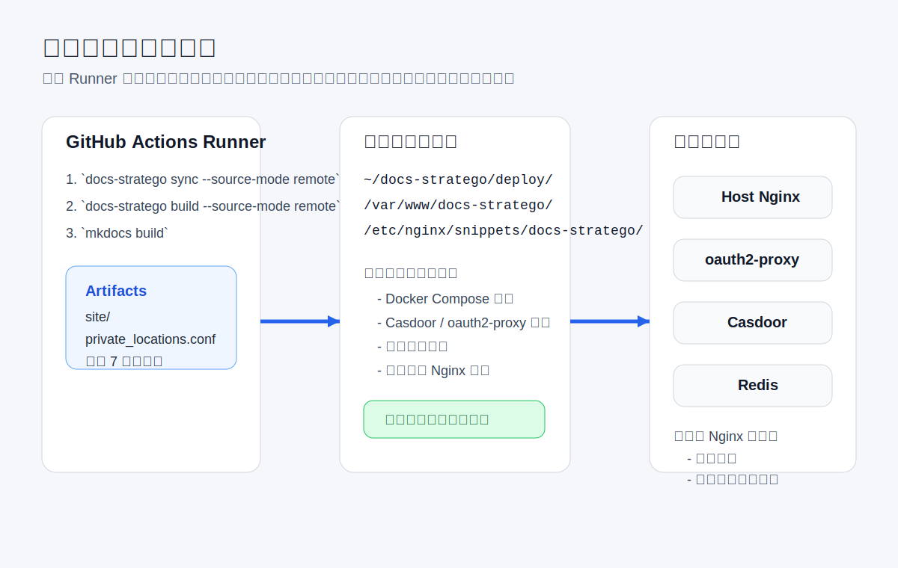

# 安装说明

这页是“首次把平台搭起来”的操作手册。  
如果你现在只是想本地预览文档，不要从这页开始，先读 [本地开发与预览](local-development.md)。

## 0. 先看安装全景



## 0.1 这页适合谁

适合下面两类人：

- 第一次搭建 `docs-stratego` 运行环境的管理员
- 需要重新核对服务器部署链路和运行目录的维护者

## 0.2 整个安装会经过哪 5 个阶段

| 阶段 | 你要完成什么 | 成功标志 |
| --- | --- | --- |
| 服务器准备 | 装好 Git、Docker、Nginx、域名和网络 | 基础命令可执行，域名解析正确 |
| 认证栈部署 | 准备 `deploy/`、`.env`、Casdoor、oauth2-proxy | `docker compose ps` 正常 |
| 宿主机 Nginx 配置 | 配好域名、静态目录、私有规则文件 | `nginx -t` 通过 |
| GitHub Actions 发布 | 配好 Secrets、GitHub App、部署变量 | workflow 能完成构建和上传 |
| 人工验收 | 验证公开页、私有页、登录闭环 | 浏览器访问与 `curl` 结果符合预期 |

## 0.3 先别混淆这两个概念

- `source_mode`
  只决定文档从哪里读，取值只有 `local` 或 `remote`
- `运行场景`
  决定这是本地开发、本地生产预演，还是正式生产发布

## 1. 目标

本文描述当前推荐的部署模型：

1. GitHub Actions 在 Runner 中完成正式生产构建
2. 服务器只承载运行时内容，不负责 `docs-stratego sync`、`docs-stratego build` 或 `mkdocs build`
3. 认证栈运行在 Docker Compose 中，组件为：
   - `postgres`
   - `casdoor`
   - `oauth2-proxy`
4. 宿主机 `Nginx` 手工维护站点配置，并引入私有页面规则文件

当前推荐口径：

- 本地开发：`source_mode=local`
- 本地生产预演：`source_mode=remote`
- GitHub Actions 正式生产发布：`source_mode=remote`

也就是说，本地完全可以用 `remote` 方式做一次“按生产输入重建”的预演，只是最终不把结果发布到服务器。

## 2. 最终目录布局

```text
~/docs-stratego/
├── .git/
└── deploy/
    ├── .env
    ├── docker-compose.yml
    ├── pg_data/
    ├── casdoor/
    │   └── app.conf
    └── oauth2-proxy/
        └── oauth2-proxy.cfg

/var/www/docs-stratego/
└── ... MkDocs 静态站点文件 ...

/etc/nginx/sites-available/
├── docs.example.com
└── auth.docs.example.com

/etc/nginx/sites-enabled/
├── docs.example.com -> ../sites-available/docs.example.com
└── auth.docs.example.com -> ../sites-available/auth.docs.example.com

/etc/nginx/snippets/docs-stratego/
└── private_locations.conf
```

默认约定：

- 认证应用运行目录：`~/docs-stratego`
- 静态站点目录：`/var/www/docs-stratego`
- 私有规则文件：`/etc/nginx/snippets/docs-stratego/private_locations.conf`
- 文档域名：`docs.example.com`
- 认证域名：`auth.docs.example.com`

## 3. 前置条件

### 3.1 服务器软件

至少需要：

- Git
- Docker Engine
- `docker compose`
- 宿主机 `Nginx`
- `sudo`

如果你是 Ubuntu/Debian 新机，通常先执行：

```bash
sudo apt update
sudo apt install -y git curl nginx
```

再按 Docker 官方文档安装 Docker Engine 与 `docker compose`。安装后确认：

```bash
git --version
docker --version
docker compose version
nginx -v
```

### 3.2 域名与端口

准备两个域名：

- `docs.example.com`
- `auth.docs.example.com`

两者都指向同一台服务器公网 IP，并开放：

- `80/tcp`
- `443/tcp`

验证方式：

```bash
dig +short docs.example.com
dig +short auth.docs.example.com
```

### 3.3 Docker 网络要求

当前 Compose 约定：

- `postgres`、`casdoor`、`oauth2-proxy` 都加入内部网络 `docs-auth-internal`
- `oauth2-proxy` 额外加入 Redis 已存在的业务网络，例如 `webapp_wps_net`

先创建内部网络：

```bash
docker network create docs-auth-internal
```

如果 Redis 容器主机名不是 `redis`，后面要同步修改 `deploy/oauth2-proxy/oauth2-proxy.cfg` 里的 `redis_connection_url`。

### 3.4 私有源仓读取要求

只要你要运行 `source_mode=remote`，无论是在本地做生产预演，还是在 GitHub Actions 正式发布，都必须保证当前环境能读取 `config/source-repos.json` 中声明的所有远程仓库。

推荐顺序：

1. GitHub Actions：GitHub App
2. 本地：使用你自己的 Git 登录态、SSH key 或凭证管理器

如果 `remote` 模式下包含私有仓，而当前环境没有对应 Git 凭证，构建会在 `git submodule update` 或 `git fetch` 阶段直接失败。

## 4. 初始化认证应用运行目录

### 4.1 用稀疏拉取只下载运行时目录

服务器不需要完整仓库，只需要认证运行所需路径：

```bash
git clone --filter=blob:none --no-checkout https://github.com/uroborus2s/docs-stratego.git ~/docs-stratego
cd ~/docs-stratego
git sparse-checkout init --no-cone
git sparse-checkout set /deploy/docker-compose.yml /deploy/casdoor/ /deploy/casdoor/** /deploy/oauth2-proxy/ /deploy/oauth2-proxy/**
git checkout main
mkdir -p ~/docs-stratego/deploy/pg_data
```

完成后，服务器上的 `~/docs-stratego` 不会包含 `docs/`、`scripts/`、`src/` 等开发与构建目录。

### 4.2 创建 `deploy/.env`

最新 `docker-compose.yml` 会从同级 `.env` 读取 Postgres 变量。创建：

```bash
cat > ~/docs-stratego/deploy/.env <<'EOF'
DB_USER=casdoor
DB_PASSWORD=replace-with-strong-password
DB_NAME=casdoor
DOCS_INTERNAL_DOCKER_NETWORK=docs-auth-internal
DOCS_REDIS_DOCKER_NETWORK=webapp_wps_net
EOF
```

说明：

- `DB_PASSWORD` 必须替换成强密码
- `DOCS_REDIS_DOCKER_NETWORK` 要改成你服务器上 Redis 实际所在的 Docker 网络名
- `deploy/pg_data/` 是 Postgres 持久化数据目录

### 4.3 核对 Casdoor 配置

编辑：

```bash
nano ~/docs-stratego/deploy/casdoor/app.conf
```

当前推荐值应与仓库默认文件保持一致：

```ini
runmode = dev
httpport = 8000
driverName = postgres
dataSourceName = ${DB_DSN}
mode = normal
level = Info
```

重点：

- `driverName` 必须是 `postgres`
- `dataSourceName` 保持 `${DB_DSN}`，不要手工写死数据库连接串
- 数据库连接串由 `docker-compose.yml` 注入容器环境变量 `DB_DSN`

### 4.4 编辑 oauth2-proxy 配置

编辑：

```bash
nano ~/docs-stratego/deploy/oauth2-proxy/oauth2-proxy.cfg
```

至少确认：

- `oidc_issuer_url = "https://auth.docs.example.com"`
- `redirect_url = "https://docs.example.com/oauth2/callback"`
- `client_id`
- `client_secret`
- `cookie_secret`
- `cookie_domains`
- `whitelist_domains`
- `redis_connection_url = "redis://redis:6379/0"`

如果你还没配置 GitHub 登录，也可以先只保证 Casdoor 本地用户名密码可用，再回头补 Casdoor 的 GitHub Provider。

## 5. 启动 Docker 认证服务

```bash
cd ~/docs-stratego/deploy
docker compose up -d
docker compose ps
```

如果启动失败，优先查：

- `~/docs-stratego/deploy/.env`
- `~/docs-stratego/deploy/casdoor/app.conf`
- `~/docs-stratego/deploy/oauth2-proxy/oauth2-proxy.cfg`
- `docker network ls`
- `docker compose logs postgres casdoor oauth2-proxy`

成功后你应当看到：

- `postgres` 正常运行
- `casdoor` 监听 `127.0.0.1:8081`
- `oauth2-proxy` 监听 `127.0.0.1:4180`

## 6. 准备静态站点目录和 Nginx 规则目录

创建静态站点目录：

```bash
sudo install -d -m 0755 -o root -g root /var/www/docs-stratego
```

创建 Nginx snippet 目录：

```bash
sudo install -d -m 0755 -o root -g root /etc/nginx/snippets/docs-stratego
```

首次部署前先放一个空规则文件，让 Nginx 可以先启动：

```bash
printf "# generated by docs-stratego deploy\n" | sudo tee /etc/nginx/snippets/docs-stratego/private_locations.conf >/dev/null
sudo chown root:root /etc/nginx/snippets/docs-stratego/private_locations.conf
sudo chmod 0644 /etc/nginx/snippets/docs-stratego/private_locations.conf
```

## 7. 手工安装宿主机 Nginx 配置

项目不会自动覆盖宿主机 `Nginx` 站点配置。首次部署请手工创建两个站点文件。

### 7.1 创建 HTTP 引导版 `docs.example.com`

```bash
sudo nano /etc/nginx/sites-available/docs.example.com
```

写入：

```nginx
server {
  listen 80;
  server_name docs.example.com;

  root /var/www/docs-stratego;
  index index.html;

  include /etc/nginx/snippets/docs-stratego/private_locations.conf;

  location /oauth2/ {
    proxy_pass http://127.0.0.1:4180;
    proxy_set_header Host $host;
    proxy_set_header X-Real-IP $remote_addr;
    proxy_set_header X-Scheme $scheme;
    proxy_set_header X-Forwarded-Proto $scheme;
    proxy_set_header X-Forwarded-Host $host;
    proxy_set_header X-Auth-Request-Redirect $request_uri;
  }

  location / {
    try_files $uri $uri/ $uri.html =404;
  }
}
```

注意：

- `location /` 只能保留静态站点的 `try_files`
- 不要在 `server {}` 根层或 `location /` 上手工写 `auth_request`
- 只有 `include /etc/nginx/snippets/docs-stratego/private_locations.conf;` 里列出的私有 URL 才应该触发登录
- 如果首页 `https://docs.example.com/` 一打开就跳 `/oauth2/sign_in`、`/oauth2/start` 或 `/login`，基本可以判定为宿主机 `Nginx` 被误配成了整站鉴权

### 7.2 创建 HTTP 引导版 `auth.docs.example.com`

```bash
sudo nano /etc/nginx/sites-available/auth.docs.example.com
```

写入：

```nginx
server {
  listen 80;
  server_name auth.docs.example.com;

  location / {
    proxy_pass http://127.0.0.1:8081;
    proxy_set_header Host $host;
    proxy_set_header X-Real-IP $remote_addr;
    proxy_set_header X-Forwarded-Proto $scheme;
    proxy_set_header X-Forwarded-Host $host;
  }
}
```

### 7.3 启用站点并检查

```bash
sudo ln -sf /etc/nginx/sites-available/docs.example.com /etc/nginx/sites-enabled/docs.example.com
sudo ln -sf /etc/nginx/sites-available/auth.docs.example.com /etc/nginx/sites-enabled/auth.docs.example.com
sudo nginx -t
sudo systemctl reload nginx
```

### 7.4 申请证书

```bash
sudo certbot certonly --nginx -d docs.example.com -d auth.docs.example.com
```

### 7.5 切到 HTTPS 正式版

`docs.example.com`：

```nginx
server {
  listen 80;
  server_name docs.example.com;

  location /.well-known/acme-challenge/ {
    root /var/www/certbot;
  }

  location / {
    return 301 https://$host$request_uri;
  }
}

server {
  listen 443 ssl http2;
  server_name docs.example.com;

  ssl_certificate /etc/letsencrypt/live/docs.example.com/fullchain.pem;
  ssl_certificate_key /etc/letsencrypt/live/docs.example.com/privkey.pem;

  root /var/www/docs-stratego;
  index index.html;

  include /etc/nginx/snippets/docs-stratego/private_locations.conf;

  location /oauth2/ {
    proxy_pass http://127.0.0.1:4180;
    proxy_http_version 1.1;
    proxy_set_header Host $host;
    proxy_set_header X-Real-IP $remote_addr;
    proxy_set_header X-Scheme $scheme;
    proxy_set_header X-Forwarded-Proto $scheme;
    proxy_set_header X-Forwarded-Host $host;
    proxy_set_header X-Forwarded-Uri $request_uri;
    proxy_set_header X-Auth-Request-Redirect $request_uri;
  }

  location / {
    try_files $uri $uri/ $uri.html =404;
  }
}
```

这里的边界仍然一样：

- `include /etc/nginx/snippets/docs-stratego/private_locations.conf;` 负责挂入私有页面规则
- `location /` 只负责静态文件命中，不负责整站登录
- 不要额外把 `auth_request`、`error_page 401 = /oauth2/sign_in;` 写到 `location /`

`auth.docs.example.com`：

```nginx
server {
  listen 80;
  server_name auth.docs.example.com;

  location /.well-known/acme-challenge/ {
    root /var/www/certbot;
  }

  location / {
    return 301 https://$host$request_uri;
  }
}

server {
  listen 443 ssl http2;
  server_name auth.docs.example.com;

  ssl_certificate /etc/letsencrypt/live/auth.docs.example.com/fullchain.pem;
  ssl_certificate_key /etc/letsencrypt/live/auth.docs.example.com/privkey.pem;

  location / {
    proxy_pass http://127.0.0.1:8081;
    # --- 必须配置：透传真实的客户端IP和协议 ---
    proxy_set_header Host $host;
    proxy_set_header X-Real-IP $remote_addr;
    proxy_set_header X-Forwarded-For $proxy_add_x_forwarded_for;
    proxy_set_header X-Forwarded-Proto $scheme;

    # --- 必须配置：防止 Nginx 拦截或丢弃包含 Body 的 POST 请求 ---
    proxy_set_header X-Forwarded-Host $host;
    proxy_pass_request_body on;
    proxy_pass_request_headers on;

    # --- 强烈建议：调大缓冲区，防止大的 JSON 包被截断 ---
    proxy_buffer_size 128k;
    proxy_buffers 4 256k;
    proxy_busy_buffers_size 256k;
  }
}
```

然后执行：

```bash
sudo nginx -t
sudo systemctl reload nginx
```

### 7.6 上线后先做两条快速验证

```bash
curl -I https://docs.example.com/
curl -I https://docs.example.com/docs-stratego/04-project-development/
```

预期结果：

- 首页应返回 `200`、`304` 或其他静态站点正常响应，不能直接跳到登录页
- 一个明确的私有页面在匿名状态下应进入登录链路

## 8. 本地生产预演

如果你想在本机按生产输入做一次预演，不需要发布到服务器，直接在完整工作区运行：

```bash
cd <project-root>
uv run docs-stratego dev --project-root . --build-only --source-mode remote
```

或者：

```bash
cd <project-root>
uv run docs-stratego sync --config config/source-repos.json --project-root . --source-mode remote
uv run docs-stratego build --config config/source-repos.json --project-root . --output-dir .generated --source-mode remote
uv run mkdocs build -f .generated/mkdocs.generated.yml -d site
```

这一步的目标是：

- 用和 GitHub Actions 相同的远程源仓输入做构建
- 在你本机提前发现私有仓凭证、分支不存在、未声明页面等问题
- 不触碰服务器运行目录

## 9. 配置 GitHub Actions 自动发布

到仓库 `Settings -> Secrets and variables -> Actions`，至少配置：

Actions Variables：

- `DOCS_SOURCE_APP_ID`

Actions Secrets：

- `DOCS_DEPLOY_HOST`
- `DOCS_DEPLOY_USER`
- `DOCS_DEPLOY_SSH_KEY`
- `DOCS_DEPLOY_PORT`
- `DOCS_DEPLOY_SITE_DIR`
- `DOCS_PRIVATE_LOCATIONS_PATH`
- `DOCS_RELOAD_HOST_NGINX`
- `DOCS_SOURCE_APP_PRIVATE_KEY`

### 9.1 GitHub App 是什么

GitHub App 可以理解成 GitHub 里的“机器身份”。

它和个人账号、PAT、OAuth App 的区别是：

- 它可以只安装到指定仓库
- 它可以只授予极小权限，例如 `Contents: Read-only`
- workflow 运行时拿到的是短期 installation token，而不是长期固定口令
- 更适合 CI/CD 拉取同账号下的多个私有仓库

当前项目把它作为私有源仓读取的唯一正式方案。

### 9.2 创建源码读取 GitHub App

推荐应用名称：

- `docs-stratego-source-reader`

创建步骤：

1. 打开 GitHub `Settings -> Developer settings -> GitHub Apps -> New GitHub App`
2. `GitHub App name` 填 `docs-stratego-source-reader`
3. `Description` 可填 `Read private source repos for docs-stratego CI builds`
4. `Homepage URL` 填 `https://github.com/uroborus2s/docs-stratego`
5. `Callback URL` 留空。这个 App 不负责浏览器登录，也不生成 user access token
6. `Expire user authorization tokens` 保持默认，不需要额外关闭
7. 不勾选 `Request user authorization (OAuth) during installation`
8. 不启用 `Enable Device Flow`
9. `Setup URL` 留空
10. 关闭 Webhook，把 `Active` 取消勾选
11. `Repository permissions` 中只授予 `Contents: Read-only`
12. 如果未来需要直接修改 `.github/workflows/*`，再额外加 `Workflows`；当前方案不需要
13. 其他所有 repository / organization / account permissions 保持 `No access`
14. `Where can this GitHub App be installed?` 选择 `Only on this account`
15. 点击 `Create GitHub App`
16. 创建完成后进入 App 详情页
17. 点击 `Generate a private key`
18. 下载 `.pem` 私钥文件并安全保存
19. 点击 `Install App`
20. 选择当前账号
21. `Repository access` 选 `Only select repositories`
22. 勾选：
23. `docs-stratego`
24. 所有会被 `source_mode=remote` 拉取的私有源仓

### 9.3 写入 GitHub Actions

在根仓 `Settings -> Secrets and variables -> Actions` 中：

1. 新建 Variable：`DOCS_SOURCE_APP_ID`
2. 填入上一步 GitHub App 的 App ID
3. 新建 Secret：`DOCS_SOURCE_APP_PRIVATE_KEY`
4. 粘贴 `.pem` 私钥完整内容
5. 保留已有部署 Secrets：`DOCS_DEPLOY_HOST`、`DOCS_DEPLOY_USER`、`DOCS_DEPLOY_SSH_KEY` 等

### 9.4 当前 workflow 的行为

1. 关闭 `actions/checkout` 对根仓 `GITHUB_TOKEN` 的持久化
2. 校验 `DOCS_SOURCE_APP_ID` 和 `DOCS_SOURCE_APP_PRIVATE_KEY` 必填
3. 通过 `actions/create-github-app-token@v3` 为当前 owner 生成 installation token
4. 用该 token 配置 Git 凭证映射
5. 执行 `sync_sources -> build_site -> mkdocs build`
6. 上传 `site/` 与 `private_locations.conf`
7. 在服务器安装制品并按需 reload Nginx

## 10. 首次人工验证

至少验证：

```bash
cd ~/docs-stratego/deploy
docker compose ps
curl -I http://127.0.0.1:4180/oauth2/auth
curl -I http://127.0.0.1:8081
curl -I https://docs.example.com
curl -I https://auth.docs.example.com
```

浏览器里验证：

1. 打开 `https://auth.docs.example.com`
2. 确认 Casdoor 登录页可访问
3. 打开 `https://docs.example.com`
4. 访问一个私有页面并确认会跳登录

## 11. 常见失败与处理

| 现象                                  | 可能原因                                      | 处理方式                                                    |
| ------------------------------------- | --------------------------------------------- | ----------------------------------------------------------- |
| `postgres` 启动失败                   | `deploy/.env` 缺少数据库变量                  | 检查 `DB_USER`、`DB_PASSWORD`、`DB_NAME`                    |
| `casdoor` 启动失败                    | `app.conf` 或数据库配置仍沿用旧版口径         | 确认 `driverName=postgres`、`dataSourceName=${DB_DSN}`      |
| `oauth2-proxy` 无法启动               | Redis 网络不通                                | 确认 `DOCS_REDIS_DOCKER_NETWORK` 与 `redis_connection_url`  |
| `git submodule update` 要求用户名密码 | `remote` 模式读取私有仓缺少凭证               | 本地补 Git 凭证；Actions 检查 GitHub App 配置和安装仓库范围 |
| 私有页面直接 500                      | Nginx 未引入 `private_locations.conf`         | 检查站点文件中的 `include`                                  |
| 登录后回不来                          | `redirect_url` 或域名不一致                   | 检查 `oauth2-proxy.cfg` 与 Casdoor Application              |
| Actions 成功但页面没更新              | `DOCS_DEPLOY_SITE_DIR` 与 Nginx `root` 不一致 | 检查 Actions 配置与站点文件                                 |
