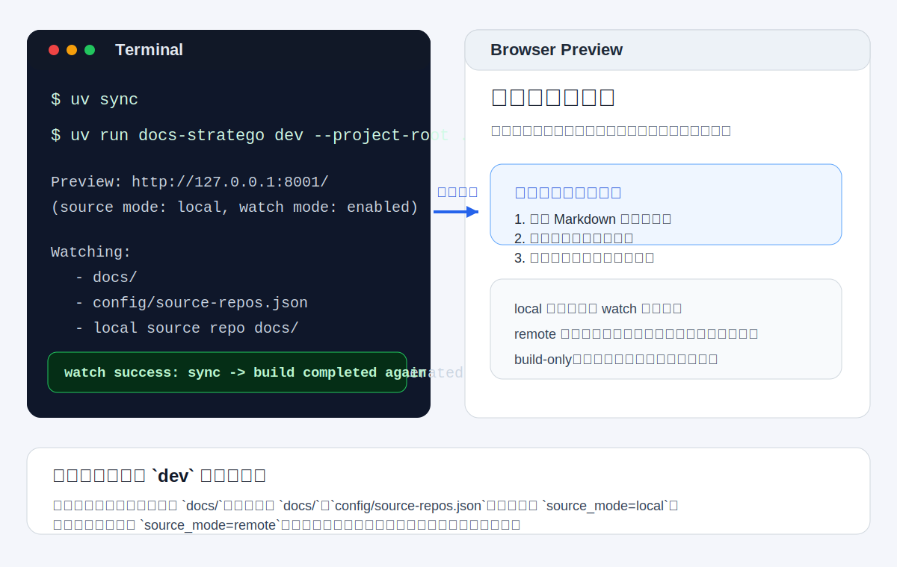

# 本地开发与预览

这页是根仓维护者最常用的日常手册。  
如果你现在只想“把站点跑起来并看到最新改动”，先看这页，不要先去读安装或发布文档。

## 1. 5 分钟启动路径

在根仓执行：

```bash
uv sync
uv run docs-stratego dev --project-root .
```

这条命令默认会：

- 使用 `source_mode=local`
- 顺序执行 `sync -> build -> mkdocs serve`
- 自动监听根仓 `docs/`、本地源仓 `docs/` 和 `config/source-repos.json`
- 在 `http://127.0.0.1:8001/` 提供预览

## 2. 你实际会看到什么



如果一切正常，终端里至少应出现两类信息：

- 预览地址，例如 `Preview: http://127.0.0.1:8001/`
- watch 状态，例如 `watch mode: enabled`

## 3. 先决定你该用 `local` 还是 `remote`

| 你的目标 | 推荐模式 | 原因 |
| --- | --- | --- |
| 快速看本地文档改动 | `local` | 直接读取维护机工作副本，最快 |
| 验证远程仓真实输入 | `remote` | 更接近 CI / 正式发布 |
| 只确认构建是否通过 | `--build-only` | 不启动预览服务，适合快速回归 |

常用命令如下：

| 场景 | 命令 |
| --- | --- |
| 本地快速预览 | `uv run docs-stratego dev --project-root .` |
| 本地生产预演 | `uv run docs-stratego dev --project-root . --source-mode remote` |
| 只做静态构建 | `uv run docs-stratego dev --project-root . --build-only` |
| 改监听地址 | `uv run docs-stratego dev --project-root . --host 0.0.0.0 --port 9000` |

## 4. `dev` 命令的边界

### 4.1 `source_mode=local`

这是默认模式，也是日常开发最推荐的模式。

它会持续监听：

- 根仓 `docs/`
- 本地源仓 `docs/`
- `config/source-repos.json`

当这些位置发生变化时，运行中的 `dev` 进程会自动重新执行 `sync -> build`。

### 4.2 `source_mode=remote`

这是“按正式输入做一次预演”的模式。

它不会持续轮询远程仓，也不会自动重建。  
如果你改了远程输入、分支或凭证，需要重新执行命令。

## 5. 改完文档后怎么判断是否生效

### 5.1 `local` 模式

通常不需要重启：

1. 保存 Markdown 或配置文件
2. 等待终端输出 `Detected source doc changes. Rebuilt generated docs.`
3. 刷新浏览器页面

### 5.2 `remote` 模式

需要重新执行：

```bash
uv run docs-stratego dev --project-root . --source-mode remote
```

如果你只关心最终构建能否成功：

```bash
uv run docs-stratego dev --project-root . --build-only
```

## 6. 什么时候应该主动重启

下面这些情况，重启比等 watch 更稳：

- 你把 `source_mode` 从 `local` 切换成 `remote`
- 你要重新验证远程仓输入，而不是本地工作副本
- 你怀疑 `mkdocs serve` 自身缓存了旧页面
- 你要重新观察一次完整冷启动日志

## 7. 常见误区

### 7.1 我改了远程仓配置，为什么没自动刷新

如果你当前跑的是 `source_mode=remote`，这是正常现象。  
`remote` 只有一次性预演，没有持续 watch。

### 7.2 我只刷新浏览器，为什么看不到改动

先看终端有没有出现 `Detected source doc changes. Rebuilt generated docs.`。  
如果没有，说明本次变更不在 `local` watch 范围内，或当前根本不是 `local` 模式。

### 7.3 我是不是必须先搭服务器才能本地开发

不需要。  
本地预览只依赖当前工作区和 CLI，不需要你先完成服务器部署。

## 8. 成功标志

如果这页的流程走通，你应该能确认 3 件事：

1. 站点能在本地打开
2. 本地 `docs/` 改动会触发自动重建
3. 你能分清 `local` 和 `remote` 的用途与边界

## 9. 下一步读什么

- 想把新源仓接进来：读 [子仓库接入指南](usage.md)
- 想看所有正式命令：读 [CLI 命令](contributor-guide/cli.md)
- 想审核同步和发布：读 [维护者指南](operator-guide.md)
