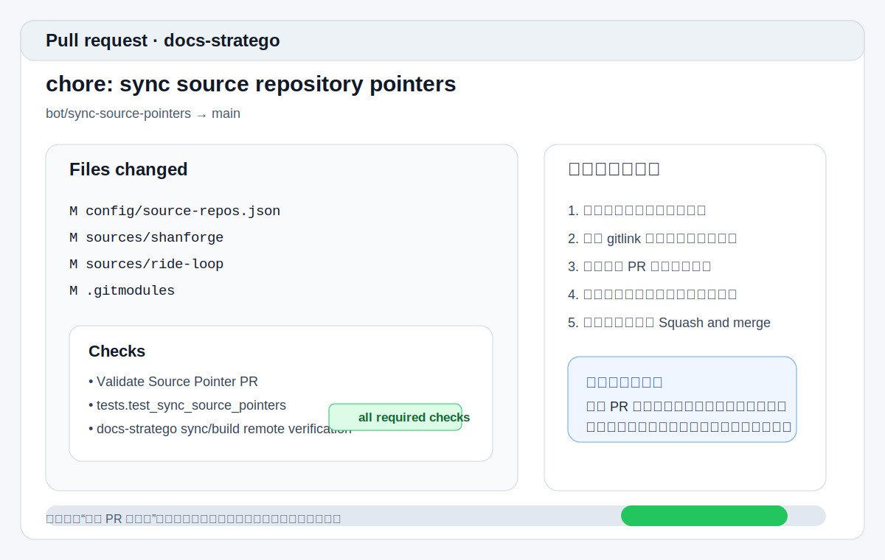

# 维护者指南

这页面向根仓的日常维护者。  
如果你的工作是“本地预览、审核共享 PR、确认发布结果、排查问题”，这页就是你的日常操作手册。

## 1. 维护者每天最常做的 3 件事

1. 在本地预览和验证文档改动
2. 审核 `bot/sync-source-pointers` 共享 PR
3. 在发布后做一轮闭环验证

## 2. 提交前先做本地预览

如果你还不熟悉 `docs-stratego dev` 的 watch 边界，请先读 [本地开发与预览](local-development.md)。

### 2.1 日常推荐命令

本地快速预览：

```bash
uv run docs-stratego dev --project-root . --source-mode local
```

发布前远程预演：

```bash
uv run docs-stratego dev --project-root . --source-mode remote
```

### 2.2 你至少要确认什么

- 站点能在 `http://127.0.0.1:8001/` 打开
- 顶部导航和左侧导航层级符合预期
- OpenAPI / MCP 契约页能正常渲染
- `source_mode=local` 下改文档会自动重建
- `source_mode=remote` 下改远程输入需要手工重跑

## 3. 如何审核共享同步 PR



当源仓开启自动联动后，根仓会生成或复用一个共享 PR：

- 标题：`chore: sync source repository pointers`
- 分支：`bot/sync-source-pointers`

### 3.1 审核顺序

按这个顺序看最稳：

1. 先看这次 PR 涉及哪些源仓
2. 再看 `sources/*` gitlink 是否符合预期
3. 确认 `Validate Source Pointer PR` 等检查全部通过
4. 如有预览链接，抽查首页、目标文档和至少一个私有页
5. 确认无误后再合并

### 3.2 不应该直接合并的情况

- PR 混入了与本次更新无关的仓库指针
- 检查未全部通过
- 预览站点缺页、导航异常或私有页权限异常

如需查看事件流和凭证边界，请读内部 [GitHub Actions 工作流报告](../04-project-development/08-operations-maintenance/github-actions-workflow-report.md)。

## 4. 发布后必须做的闭环验证

当代码合并到 `main` 并触发发布后，至少检查下面 4 项：

| 验证项 | 操作 | 预期结果 |
| --- | --- | --- |
| 匿名可读性 | 无登录状态访问首页 | 正常显示且无登录弹窗 |
| 私有页锁定 | 点击 `access: private` 页面 | 触发登录小窗 |
| 登录闭环 | 完成 GitHub / Casdoor 登录 | 小窗关闭，页面内容正常显示 |
| Nginx 状态 | 直接访问私有 URL | 进入认证链路，而不是匿名打开 |

## 5. 故障排查优先级

### 5.1 共享 PR 看起来不对

优先检查：

1. 是否有多个子仓同时通知
2. 当前 PR 是否复用了旧分支
3. 这次 gitlink 变化是否真来自目标源仓

### 5.2 发布通过但站点没更新

优先看：

1. `Deploy Docs` workflow 的 artifact 安装步骤
2. 服务器上的 `site/` 与 Nginx `root` 路径是否一致
3. `systemctl reload nginx` 是否成功

### 5.3 私有页变成匿名可见

优先检查：

1. 根 `docs/index.md` 页面节点的 `access`
2. `.generated/nginx/private_locations.conf` 是否已更新
3. 宿主机 Nginx 是否正确引入了该规则文件

### 5.4 登录小窗报错

优先检查：

1. `docker compose ps`
2. `oauth2-proxy` 与 `casdoor` 容器日志
3. Redis 网络与会话配置

## 6. 成功维护一次变更的判断标准

如果一次维护闭环完整，你应该能确认：

1. 本地预览通过
2. 共享 PR 内容正确且检查通过
3. 合并后站点发布成功
4. 匿名页和私有页行为都符合预期

## 7. 接下来读什么

- 想重新熟悉本地 watch 行为：读 [本地开发与预览](local-development.md)
- 想看接入或联动步骤：读 [子仓库接入指南](usage.md)
- 想处理平台级配置或发布权限：读 [管理员指南](admin-guide.md)
