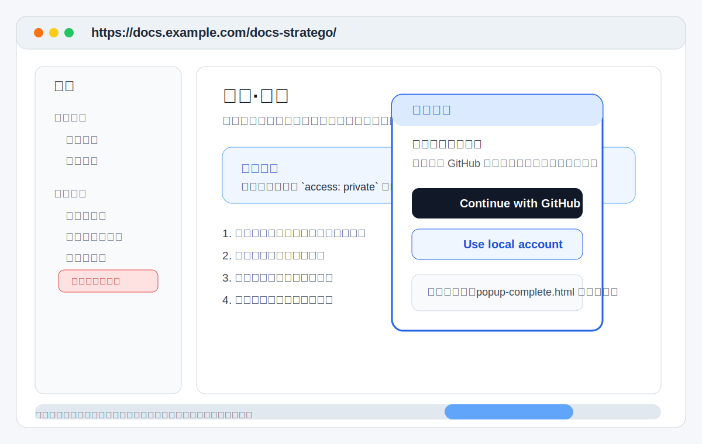

# 阅读者指南

这页只回答一件事：作为普通阅读者，你在站点里会看到什么，以及遇到登录时应该如何理解和处理。

## 1. 这套站点对阅读者意味着什么

`docs-stratego` 把多个项目的文档聚合在同一个站点里。

作为阅读者，你不需要先知道这些文档来自哪个仓库，也不需要去不同项目里找 Markdown 文件。  
你只需要知道两条访问规则：

- 公开页面可以直接打开
- 私有页面只有在真正进入时才要求登录

## 2. 你会看到的典型交互

### 2.1 打开公开页面

你会直接看到页面内容，不会先跳登录页。

### 2.2 点击私有页面

系统不会马上把整个站点变成登录态，而是：

1. 保留你当前所在页面
2. 弹出一个独立登录小窗
3. 让你使用 GitHub 或本地账号登录
4. 登录成功后自动关闭小窗，并继续进入目标私有页

### 2.3 直接输入私有页面 URL

也是允许的。

如果你尚未登录，系统会先把你带入登录流程；登录成功后，再返回你要看的私有页面。

## 3. 这不代表什么

如果你在导航里能看到某个页面，但点击后要登录，这不代表系统异常。  
这只说明该页面被维护者标记为了 `access: private`。

常见场景包括：

- 内部设计文档
- 敏感配置说明
- 不适合匿名公开的交付材料

## 4. 什么时候应该认为站点有问题

下面这些现象才更像故障，而不是正常权限行为：

- 首页一打开就直接跳登录页
- 公开页面也被要求登录
- 点击私有页完全没有弹出窗口，也没有任何提示
- 登录成功后，小窗不关闭，目标页面也不打开

## 5. 阅读者侧最常见的问题

### 5.1 为什么有些页面要求登录，有些不用

因为权限是按页面而不是整站设置的。  
同一个导航里可以同时存在公开页和私有页。

### 5.2 登录小窗没有弹出怎么办

先按这个顺序检查：

1. 浏览器是否拦截了弹窗
2. 是否在无痕模式或严格隐私模式下阻止了登录流程
3. 刷新页面后再次点击私有页

### 5.3 我能不能一直保持登录

通常可以，具体取决于认证服务和会话过期时间。  
如果会话仍有效，再次点击私有页时通常会直接进入，不再重复弹窗。

### 5.4 我不知道一页是公开还是私有怎么办

最直接的判断方式就是点击它：

- 能直接打开，就是公开页
- 弹出登录小窗，就是私有页

## 6. 如果你不是普通阅读者，接下来读什么

- 想本地预览站点：读 [本地开发与预览](local-development.md)
- 想接入源仓：读 [子仓库接入指南](usage.md)
- 想排查登录或发布问题：读 [维护者指南](operator-guide.md)
