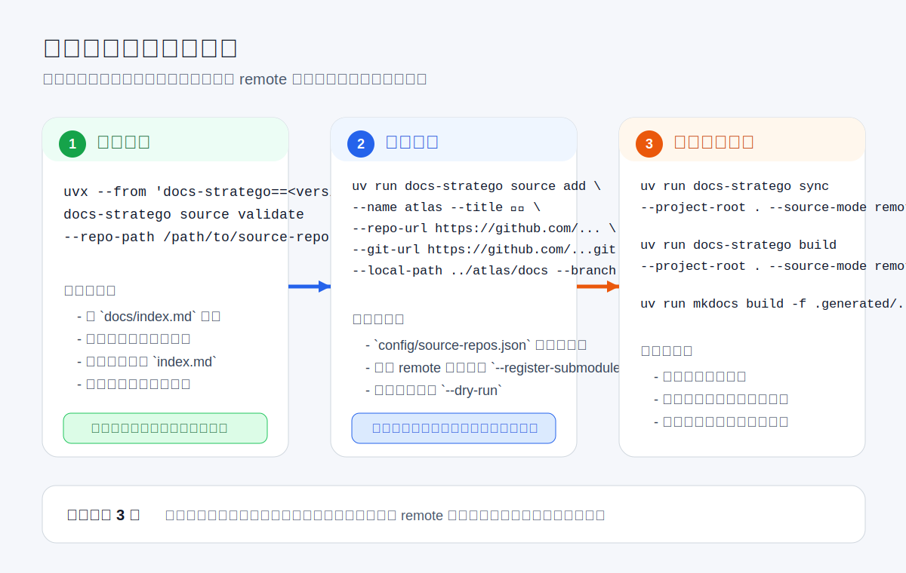

# 子仓库接入指南

这页是接入相关内容的总入口。  
如果你眼前的任务和“把一个源仓接进来、联动起来、再安全移出去”有关，就从这页开始。

## 1. 你在这套指南里最常做的 4 件事

| 你现在要做什么 | 先读哪页 | 读完后应完成什么 |
| --- | --- | --- |
| 第一次接入一个新源仓 | [源文档标准](contributor-guide/source-docs-standard.md) → [接入聚合站点](contributor-guide/onboarding.md) | 源仓通过校验，并成功登记到根仓 |
| 补齐自动联动 | [自动联动](contributor-guide/automation.md) | 源仓 `docs/**` 变更后能通知根仓共享 PR |
| 安全下线一个源仓 | [移除流程](contributor-guide/offboarding.md) | 自动联动和根仓登记都被安全移除 |
| 把 CLI 发给外部源仓使用 | [CLI 分发与发布](contributor-guide/distribution.md) → [发布前外部配置](contributor-guide/publish-setup.md) → [CLI 发布手册](contributor-guide/release.md) | 外部源仓可以按固定版本安装和执行 CLI |

## 2. 先记住 CLI 的使用边界

`docs-stratego` 有两种运行方式：

- 在 `docs-stratego` 根仓内开发或 CI：先执行 `uv sync --extra site`，再使用 `uv run docs-stratego ...`
- 在外部源仓直接调用：先发布为可安装包，再使用 `uvx` 或 `uv tool install`

如果你是源仓接入方，不要把 `uv run docs-stratego ...` 理解成“任意仓库天然可用”的命令。

## 3. 第一次接入时的最短闭环

如果你只想快速完成一次正确接入，请按下面顺序走：

1. 阅读 [源文档标准](contributor-guide/source-docs-standard.md)
2. 在源仓运行 `source validate`
3. 在根仓运行 `source add`
4. 用 `sync --source-mode remote`、`build --source-mode remote`、`mkdocs build` 做一次真实构建验证
5. 如果该源仓未来还会持续更新，再补 [自动联动](contributor-guide/automation.md)

## 4. 这套指南解决哪些知识盲点

以前最容易混淆的点有 4 个：

- 源仓侧和根仓侧命令到底分别在哪执行
- 源仓接入完成后，是否还要额外配置自动联动
- 本地 `uv run docs-stratego ...` 能不能直接拿去给外部源仓使用
- CLI 发布到 TestPyPI / PyPI 前，到底要先去 GitHub 和包仓库上配什么

当前这些问题分别对应到：

- [接入聚合站点](contributor-guide/onboarding.md)
- [自动联动](contributor-guide/automation.md)
- [CLI 命令](contributor-guide/cli.md)
- [发布前外部配置](contributor-guide/publish-setup.md)

## 5. 命令入口总表

这组任务会用到的正式命令是：

- `uv run docs-stratego dev`
- `uvx --from 'docs-stratego==<version>' docs-stratego source validate`
- `uv run docs-stratego source add`
- `uvx --from 'docs-stratego==<version>' docs-stratego source scaffold-notify`
- `uv run docs-stratego source remove`
- `uv run docs-stratego source sync-pointers`
- `uv run docs-stratego sync`
- `uv run docs-stratego build`

完整参数和安全开关见 [CLI 命令](contributor-guide/cli.md)。

## 6. 推荐阅读顺序

### 只做接入

1. [源文档标准](contributor-guide/source-docs-standard.md)
2. [接入聚合站点](contributor-guide/onboarding.md)
3. [CLI 命令](contributor-guide/cli.md)

### 接入后还要持续联动

1. [接入聚合站点](contributor-guide/onboarding.md)
2. [自动联动](contributor-guide/automation.md)
3. [维护者指南](operator-guide.md)

### 需要发布 CLI

1. [CLI 分发与发布](contributor-guide/distribution.md)
2. [发布前外部配置](contributor-guide/publish-setup.md)
3. [CLI 发布手册](contributor-guide/release.md)

## 7. 这组页面各自解决什么问题

- [接入知识地图](contributor-guide/index.md)：帮你判断每一页解决什么问题。
- [源文档标准](contributor-guide/source-docs-standard.md)：告诉你源仓 `docs/` 怎么写才合规。
- [接入聚合站点](contributor-guide/onboarding.md)：告诉你如何把源仓登记进根仓。
- [自动联动](contributor-guide/automation.md)：告诉你如何把源仓变更自动推到根仓共享 PR。
- [移除流程](contributor-guide/offboarding.md)：告诉你如何停联动或完整下线。
- [CLI 命令](contributor-guide/cli.md)：告诉你不同场景下该执行哪些命令。
- [CLI 分发与发布](contributor-guide/distribution.md)：告诉你如何把 CLI 交给外部源仓使用。
- [发布前外部配置](contributor-guide/publish-setup.md)：告诉你 GitHub、TestPyPI、PyPI 的首次配置怎么做。
- [CLI 发布手册](contributor-guide/release.md)：告诉你真正发版时的执行步骤。
