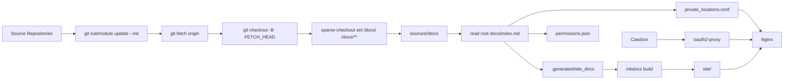

# 系统架构

## 组件职责

- `sync_sources.py`：更新子模块到目标分支，并在子模块内部只展开 `docs/`
- `build_site.py`：解析根 `docs/index.md` 的全站清单，生成导航、权限清单和 Nginx 规则
- `mkdocs build`：只负责把已整理好的文档树编译成静态站点
- `Casdoor`：提供用户名密码、GitHub 登录和用户管理
- `oauth2-proxy`：把 Casdoor 登录态转成 Nginx 可用的 `auth_request`
- `Nginx`：服务静态页面，并对私有页面路径发起认证请求
