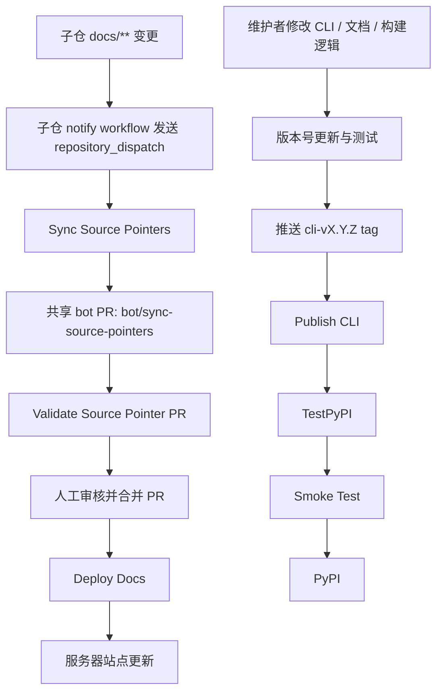

# GitHub Actions 工作流报告

## 1. 报告目标

本文梳理当前仓库全部 GitHub Actions workflow 的职责、触发条件、凭证依赖、关键步骤、产物流转和风险边界。

当前仓库共有 4 个 workflow：

1. `Deploy Docs`
2. `Sync Source Pointers`
3. `Validate Source Pointer PR`
4. `Publish CLI`

## 2. 总览表

| Workflow | 触发条件 | 主要职责 | 关键输出 |
| --- | --- | --- | --- |
| `Deploy Docs` | `push main/master`、`workflow_dispatch` | 远程模式拉取源仓、构建站点并部署到服务器 | `site/`、`private_locations.conf`、线上静态站点 |
| `Sync Source Pointers` | `repository_dispatch`、`workflow_dispatch` | 汇总已接入子仓的 gitlink 变化并维护共享 bot PR | `bot/sync-source-pointers` 分支与共享 PR |
| `Validate Source Pointer PR` | `pull_request` 到 `main/master`，且 `head_ref == bot/sync-source-pointers` | 校验共享 bot PR 的远程构建结果 | 通过/失败的 PR 校验结果 |
| `Publish CLI` | `push` 到 `cli-v*.*.*` tag、`workflow_dispatch` | 构建 CLI 包并发布到 TestPyPI / PyPI | `dist/*`、TestPyPI 包、PyPI 包 |

## 3. 整体关系图

## 4. `Deploy Docs`

### 4.1 作用

这是正式文档站的发布 workflow。它把“远程拉取源仓 -> 构建站点 -> 上传产物 -> 通过 SSH/SCP 发布到服务器”收口成标准流水线。

### 4.2 触发方式

- `push` 到 `main`
- `push` 到 `master`
- `workflow_dispatch`

### 4.3 流程拆解

`Deploy Docs` 分成 2 个 job：

| Job | 作用 | 关键步骤 |
| --- | --- | --- |
| `validate` | 在 Runner 上完成真实构建输入验证 | checkout、`uv sync --frozen --extra site`、单测、GitHub App 校验、`docs-stratego sync --source-mode remote`、`docs-stratego build --source-mode remote`、`mkdocs build`、上传 artifact |
| `deploy` | 把构建产物发布到服务器 | 下载 artifact、打包 `site/`、通过 SSH 确保目录存在、通过 SCP 上传、解压站点、安装 `private_locations.conf`、可选 reload `nginx` |

### 4.4 凭证与依赖

| 类型 | 名称 | 用途 |
| --- | --- | --- |
| Actions Variable | `DOCS_SOURCE_APP_ID` | GitHub App ID，用于读取私有源仓 |
| Actions Secret | `DOCS_SOURCE_APP_PRIVATE_KEY` | GitHub App 私钥 |
| Actions Secret | `DOCS_DEPLOY_HOST` | 部署服务器地址 |
| Actions Secret | `DOCS_DEPLOY_USER` | SSH 用户 |
| Actions Secret | `DOCS_DEPLOY_SSH_KEY` | SSH 私钥 |
| Actions Secret | `DOCS_DEPLOY_PORT` | SSH 端口，可选 |
| Actions Secret | `DOCS_DEPLOY_SITE_DIR` | 远端静态站点目录，可选 |
| Actions Secret | `DOCS_PRIVATE_LOCATIONS_PATH` | 远端私有规则文件路径，可选 |
| Actions Secret | `DOCS_RELOAD_HOST_NGINX` | 是否 reload `nginx`，可选 |

### 4.5 关键产物

- `site/`
- `.generated/nginx/private_locations.conf`
- workflow artifact `docs-build-output`

### 4.6 风险边界

- 如果 GitHub App 凭证缺失，workflow 会在远程拉取源仓前失败
- 如果远端私有源仓文档不合规，workflow 会在 `sync/build` 阶段失败
- 如果 SSH 或远端目录权限异常，workflow 会在 `deploy` 阶段失败
- 当前没有单独的 PR 预览站点；只有合并后正式部署

## 5. `Sync Source Pointers`

### 5.1 作用

这个 workflow 负责把多个子仓的文档指针变化收敛成同一个共享 bot PR，而不是每个子仓单独开一条根仓发布链路。

### 5.2 触发方式

- `repository_dispatch` 事件 `source-pointer-sync-requested`
- `workflow_dispatch`

### 5.3 流程拆解

| 步骤 | 动作 | 说明 |
| --- | --- | --- |
| 1 | checkout 根仓 | 关闭持久化凭证，保留完整历史 |
| 2 | 安装 Python / uv / 依赖 | 保证 CLI 可运行 |
| 3 | 校验凭证 | 检查 GitHub App 与 PAT 是否存在 |
| 4 | 创建 GitHub App token | 读取私有源仓用 |
| 5 | 配置 Git 凭证 | 读子仓走 GitHub App，写根仓走 PAT |
| 6 | 执行 `docs-stratego source sync-pointers` | 更新 gitlink，复用或创建共享 bot PR |

### 5.4 凭证与依赖

| 类型 | 名称 | 用途 |
| --- | --- | --- |
| Actions Variable | `DOCS_SOURCE_APP_ID` | 读取私有源仓 |
| Actions Secret | `DOCS_SOURCE_APP_PRIVATE_KEY` | GitHub App 私钥 |
| Actions Secret | `DOCS_STRATEGO_SYNC_PAT` | 推送根仓 bot 分支并维护 PR |

### 5.5 结果

- 更新 `sources/*` gitlink
- 推送或刷新 `bot/sync-source-pointers`
- 复用固定标题的共享 PR：`chore: sync source repository pointers`

### 5.6 风险边界

- 这是汇总入口，不直接部署生产站点
- 多个 dispatch 会被并发组 `sync-source-pointers` 收敛
- 没有 `DOCS_STRATEGO_SYNC_PAT` 时，即使能读到私有源仓，也无法写回根仓

## 6. `Validate Source Pointer PR`

### 6.1 作用

这是共享 bot PR 的专用校验 workflow，用来阻止不合规的子仓指针变化直接合并进主干。

### 6.2 触发方式

- `pull_request` 指向 `main` 或 `master`
- 仅当 `github.head_ref == 'bot/sync-source-pointers'` 时执行

### 6.3 流程拆解

| 步骤 | 动作 | 说明 |
| --- | --- | --- |
| 1 | checkout PR 代码 | 验证共享 PR 当前状态 |
| 2 | 安装 Python / uv / 依赖 | 保证 CLI 可运行 |
| 3 | 跑单测 | 校验 CLI 和构建器不回退 |
| 4 | 创建 GitHub App token | 读取私有源仓 |
| 5 | `docs-stratego sync --source-mode remote` | 用真实远程输入重建 |
| 6 | `docs-stratego build --source-mode remote` | 生成 MkDocs 配置与权限清单 |
| 7 | `mkdocs build` | 确认站点最终可构建 |

### 6.4 风险边界

- 只保护共享 bot PR，不会给普通业务 PR 提供相同验证
- 它是合并前闸门，不负责部署

## 7. `Publish CLI`

### 7.1 作用

这是 CLI 包的发布 workflow，专门处理：

- 版本号读取
- tag 与版本号一致性校验
- 打包 `dist/*`
- 发布到 TestPyPI
- 从 TestPyPI 做烟雾验证
- 发布到正式 PyPI

### 7.2 触发方式

- `push` 到 `cli-v*.*.*` tag
- `workflow_dispatch`

### 7.3 流程拆解

| Job | 作用 | 关键动作 |
| --- | --- | --- |
| `build` | 打包前校验 | 读取版本号、校验 tag、单测、`uv build --no-sources`、上传 `dist/*` |
| `publish-testpypi` | 发 TestPyPI | 下载产物并执行 `uv publish --index testpypi --no-attestations` |
| `smoke-test-testpypi` | 烟雾验证 | 用 `uvx --refresh --from docs-stratego==<version>` 跑 `--help` 与 `source validate --help` |
| `publish-pypi` | 发正式 PyPI | 下载产物并执行 `uv publish --no-attestations` |

### 7.4 凭证与依赖

| 类型 | 名称 | 用途 |
| --- | --- | --- |
| GitHub Environment | `testpypi` | TestPyPI 发布 job 环境 |
| GitHub Environment | `pypi` | 正式 PyPI 发布 job 环境 |
| Job Permission | `id-token: write` | 让 PyPI / TestPyPI 通过 OIDC 信任 GitHub Actions |

### 7.5 关键边界

- `push tag` 场景下会校验 tag 是否与 `pyproject.toml` 版本一致
- `workflow_dispatch` 场景下不会执行 tag 一致性校验
- `workflow_dispatch` 的 `publish_target=both` 允许维护者手动直发正式 PyPI

### 7.6 当前结论

这条 workflow 具备两种发布路径：

1. 正式推荐路径：改版本号、打 `cli-vX.Y.Z` tag、自动发版
2. 维护者手动路径：`workflow_dispatch`

如果以后要进一步收紧生产发布边界，最直接的做法是把 `workflow_dispatch` 限制为只允许 `testpypi`，把正式 PyPI 完全收口到 tag 触发。

## 8. 当前工作流分工是否清晰

当前分工是清晰的：

- 子仓变更汇总由 `Sync Source Pointers` 负责
- 共享 PR 合并前验证由 `Validate Source Pointer PR` 负责
- 主干合并后的正式站点发布由 `Deploy Docs` 负责
- CLI 包发布由 `Publish CLI` 负责

这意味着“文档站发布”和“CLI 包发布”已经完全分离，不会相互污染。

## 9. 建议结论

从当前实现看，工作流体系已经具备较好的职责拆分，但仍有 3 个需要长期注意的点：

1. `Publish CLI` 的手动 `both` 仍然可以绕过 tag 路径直发正式 PyPI，这是一条有意保留但风险更高的维护者通道。
2. `Deploy Docs` 目前只有主干发布，没有 PR 级预览站点，评审体验主要依赖本地验证和共享 bot PR 校验。
3. `Sync Source Pointers` 依赖两套凭证：GitHub App 负责读、PAT 负责写；如果后续权限治理变化，这条链路最需要优先回归。
